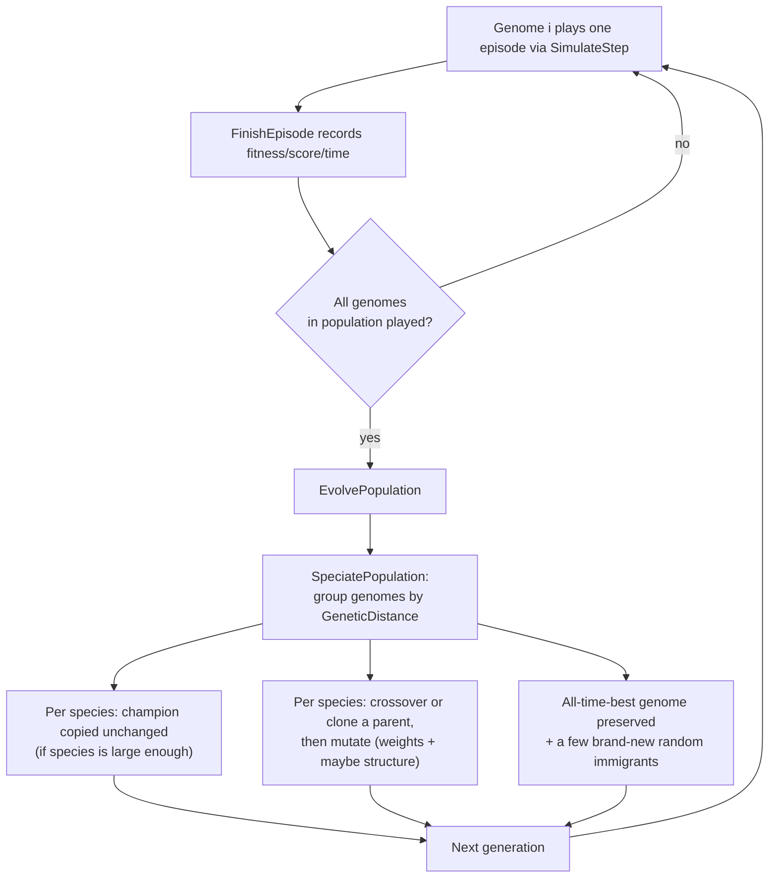

# Architecture

## Stack

- C++17, raylib for window/input/drawing/shapes
- CMake, Makefile wrapper (`make dev`, `make sweep`)
- no ML libraries. NEAT (neuroevolution) — genome representation, mutation, crossover, speciation, forward pass — is all hand-rolled
- std::thread for the sweep, nothing else external

## ML approach

- neuroevolution via **NEAT** (NeuroEvolution of Augmenting Topologies), not gradient-based RL. no backprop, no loss function, no policy gradient.
- a genome is a variable-topology graph: node genes + connection genes (weight, enabled flag, innovation number), not a fixed-size weight vector. structure starts minimal (every input wired straight to every output, zero hidden nodes) and only grows via mutation.
- **structural mutation**: `MutateAddConnection` wires up two previously-unconnected nodes (rejecting anything that would create a cycle — the graph must stay feed-forward); `MutateAddNode` splits an existing connection with a new hidden node, whose outgoing weight starts at exactly `0.0` — a freshly grown node has zero effect on behavior the instant it appears, so it can never make a genome look better or worse until later weight mutations actually give it something to say.
- **innovation numbers**: every connection gene's historical origin is tracked (see `InnovationTracker` in [Genome.h](Genome.h)), so if two different genomes independently evolve "the same" structural change, they get the same innovation number. That's what makes `Crossover` meaningful — two genomes' genes are aligned by innovation number instead of by position.
- **speciation**: genomes are grouped into species by `GeneticDistance` (excess/disjoint gene counts + average weight difference). Each species mostly reproduces within itself, which is what protects a brand-new structural mutation long enough to have its weights tuned before it has to compete head-to-head with a fully-optimized genome from a different lineage. A species' champion is carried over unchanged once it has enough members; one all-time-best genome is preserved regardless of what happens to its species.
- fitness = reward from actually playing the episode (survival + hits + kills - death/touch penalties).
- mutation rate/strength — and how often structural mutations fire — all auto-ramp up when fitness stalls, back down once it improves.

## Network inputs and outputs

The brain is a NEAT genome evaluated as a feed-forward graph (topological evaluation with memoization — see `Activate` in [Genome.cpp](Genome.cpp)), not a fixed dense layer. Hidden nodes only exist if mutation has grown them; a brand new genome has none. Sizes are computed from `PLAYER_AGENT_*` constants in [PlayerAgent.h](PlayerAgent.h), so they always match what `GetPlayerState`/`DecidePlayerAction` in [PlayerAgent.cpp](PlayerAgent.cpp) actually build/decode.

**Inputs — 34 total** (`PLAYER_AGENT_INPUT_SIZE`): 9 player features, 6 features for each of the 4 nearest enemies (closest first), 1 aggregate feature.

| # | Feature | Normalization |
|---|---|---|
| 0 | player x | `/ screenWidth` |
| 1 | player y | `/ screenHeight` |
| 2 | player health | `/ maxHealth` |
| 3 | player velocity x | `/ player.speed` |
| 4 | player velocity y | `/ player.speed` |
| 5 | facing cos | `GetAimDirection(player).x` |
| 6 | facing sin | `GetAimDirection(player).y` |
| 7 | nearest x-wall distance | `/ (screenWidth / 2)`, 0 = touching, 1 = center |
| 8 | nearest y-wall distance | `/ (screenHeight / 2)`, 0 = touching, 1 = center |
| 9–14 | nearest enemy: bodyX, bodyY, distance, health, bodyVX, bodyVY | position/velocity rotated into the player's facing frame (see below), `/ screen diagonal`; health `/ maxHealth` |
| 15–20 | 2nd-nearest enemy: same 6 features | same |
| 21–26 | 3rd-nearest enemy: same 6 features | same |
| 27–32 | 4th-nearest enemy: same 6 features | same |
| 33 | active enemy count | `min(count / 10, 1.0)` |

Enemy position and velocity are rotated by `-player.rotation` before being fed in, so `bodyX` is "how far ahead of my gun" and `bodyY` is "how far to the side" — a direct aim-error signal that doesn't depend on which way the player happens to be facing. An empty enemy slot (fewer than 4 enemies alive) zeroes its 6 features except distance, which is set to `1.0` ("maximally far away") so the network can tell "no enemy here" apart from "an enemy is very close."

**Outputs — 5 total** (`PLAYER_AGENT_OUTPUT_SIZE`), decoded in `DecidePlayerAction`:

| # | Meaning | Activation |
|---|---|---|
| 0 | move.x | `tanh` |
| 1 | move.y | `tanh` |
| 2 | aim.x | `tanh` |
| 3 | aim.y | `tanh` |
| 4 | shoot | `sigmoid > 0.5` |

If both aim outputs are ~0, the player keeps its current facing rather than snapping to an undefined direction. Movement eases toward the commanded direction (capped acceleration) and aim turns toward the commanded direction (capped turn rate) instead of either snapping instantly — see `UpdatePlayer` in [Player.cpp](Player.cpp).

```mermaid
flowchart LR
    subgraph Inputs["Input layer — 34 nodes"]
        direction TB
        P["Player — 9<br/>x, y, health, vx, vy,<br/>facing cos/sin, wall dist x/y"]
        E0["Nearest enemy #1 — 6<br/>bodyX, bodyY, dist, health, bodyVX, bodyVY"]
        E1["Nearest enemy #2 — 6"]
        E2["Nearest enemy #3 — 6"]
        E3["Nearest enemy #4 — 6"]
        C["Active enemy count — 1"]
    end
    Inputs --> G["Hidden structure — grows from zero<br/>via MutateAddNode/MutateAddConnection"]
    G --> Outputs

    subgraph Outputs["Output layer — 5 nodes"]
        direction TB
        M["move.x, move.y — tanh"]
        A["aim.x, aim.y — tanh"]
        S["shoot — sigmoid > 0.5"]
    end
```

A minimal genome skips the hidden structure entirely — every input (plus an always-on bias node) connects straight to every output.

**Evolution loop**, one generation:

Each species' offspring count is proportional to its total fitness-shared fitness (dividing by species size, so a small young species isn't swamped by one big one). A species stuck for 15+ generations without improving stops getting offspring — unless it's the species currently holding the best genome, which is never fully extinguished. Immigrant count, mutation rate/strength, and structural mutation chance all scale up the longer the whole population has gone without improving (see `stagnationBoost` in [Evolution.cpp](Evolution.cpp)).

## Files

**main.cpp** — entry point. picks `--sweep` or the interactive loop. owns the window, HUD, speed button, autosave timing.

**Simulation.h/.cpp** — all the game constants (player/bullet/enemy/reward/evolution defaults) and `SimulateStep`, one game tick: movement, shooting, collisions, reward, episode end. Used by both interactive play and the sweep.

**Player.h/.cpp, Enemy.h/.cpp** — plain structs + free functions, no classes. position, health, collision boxes, drawing.

**Genome.h/.cpp** — the NEAT genome: node/connection genes, innovation tracking, mutation (weights, add-connection, add-node), crossover, `GeneticDistance`, and `Activate` (the feed-forward graph evaluator that replaces a fixed dense-layer forward pass).

**PlayerAgent.h/.cpp** — glue between game state and the network. builds the input vector (player + 4 nearest enemies, enemy features rotated into the player's facing frame), decodes outputs into move/aim/shoot.

**Evolution.h/.cpp** — population, speciation, per-species reproduction (crossover + mutation), stagnation-triggered mutation/structural-mutation boost. save/load to `save.dat` — versioned, deliberately refuses to load a file with the wrong shape (species aren't persisted — they're cheap to rebuild from scratch on the first generation after a resume).

**HistoryGraph.h/.cpp** — the fitness/score/time line graphs. same drawing code renders the in-game Tab overlay and the sweep's exported PNGs.

**ParameterSweep.h/.cpp** — `--sweep` mode. CLI flag parsing, runs configs (population size) across worker threads, writes `sweep_results.txt` + `README.md` + `sweep_images/`.

**RandomUtil.h** — thread-local RNG. exists because the sweep runs configs in parallel and raylib's `GetRandomValue` isn't thread-safe.

## Why it's split this way

- `SimulateStep` doesn't know or care if anyone's watching — same function runs live in the window at 1x-49152x speed, or headless on a sweep thread.
- game logic never calls raylib drawing functions, only `CheckCollisionRecs` (pure math, safe off the main thread).
- sweep training runs fully parallel with no window at all. the window only opens afterward, on the main thread, to export PNGs — raylib's GL calls aren't thread-safe so that part has to stay single-threaded.
- `Genome`'s algorithms (mutation, crossover, distance, evaluation) know nothing about the game — `PlayerAgent` is the only file that translates between "player + enemies" and "a vector of floats," so the ML core is reusable for a completely different game with zero changes.
