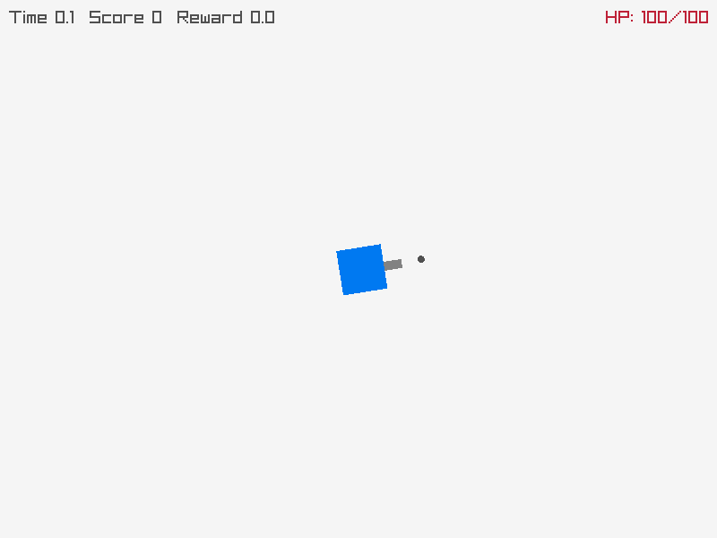
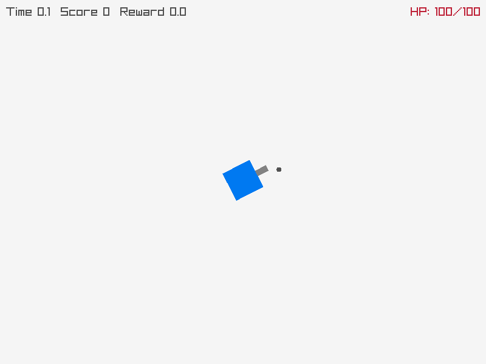
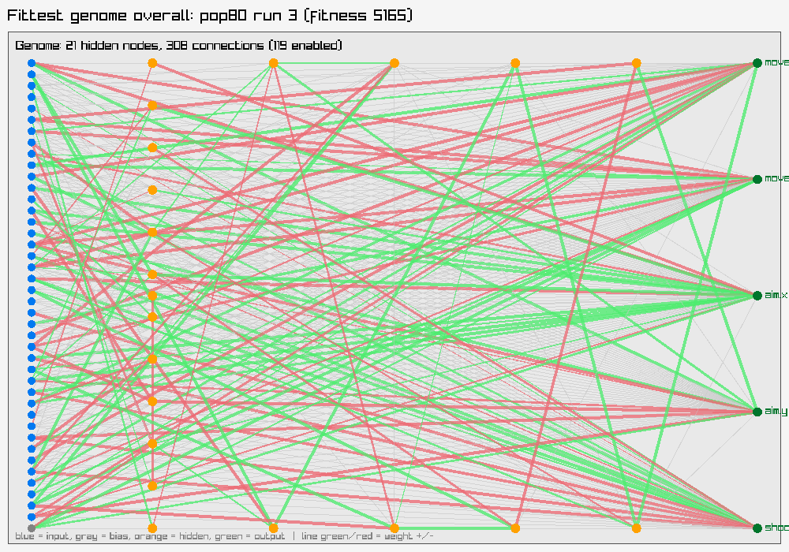
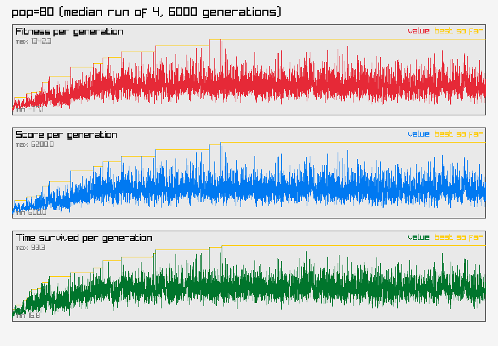

# Space Shooter ML

A twin-stick space shooter where the player is controlled entirely by a hand-rolled NEAT
(NeuroEvolution of Augmenting Topologies) agent — no ML libraries, no gradient descent. The
network's structure and weights are both evolved purely by playing the game.

## Usage

```
make dev    # build and play interactively, watch the agent train live
make sweep  # population-size parameter sweep, writes RESULTS.md
```

Override sweep defaults with `ARGS`:

```
make sweep ARGS="--populations=80,160 --generations=6000 --repeats=4 --seed=42"
```

`--seed` makes a run reproducible byte-for-byte, regardless of core count or thread
scheduling. Omit it for a fresh auto-generated seed — it's always printed and saved into
`RESULTS.md`, so any run can be reproduced later. `make sweep` also prints a ready-to-use
`make recordings` command for whichever run came out fittest.

To retrain one specific run and record it at chosen generation milestones:

```
make recordings ARGS="--population=80 --seed=16201731495207994628 --checkpoints=1,6000 --max-seconds=300"
```

Checkpoints land in `recordings/checkpoints/`, gifs in `recordings/gifs/` — one gif per
milestone for the all-time-best genome, plus a separate one for whichever genome/episode hit
the highest raw score (tracked independently from fitness, since they're often different
genomes). Both are gitignored; regenerate anytime.

# Sample run

1st generation — score 400, survived 15 seconds:



Generation 6000 — score 20,800, survived 278 seconds:



The learned network:



Fitness over the run:



## Documentation

- [ARCHITECTURE.md](ARCHITECTURE.md) — the NEAT genome representation, mutation/crossover/speciation, network inputs and outputs, and how the pieces fit together (with diagrams).
- [input.md](input.md) — append-only changelog of every change to the network's input vector and why.
- `RESULTS.md` — parameter-sweep results, generated by `make sweep` (not present until you run it) — includes an input-usage report and the fittest genome's network diagram.

## Archive

An earlier version of this project used a fixed-topology network with a plain (μ+λ) evolution
strategy instead of NEAT. Preserved for reference in [archive/v1-fixed-topology/](archive/v1-fixed-topology/):

- [archive/v1-fixed-topology/ARCHITECTURE.md](archive/v1-fixed-topology/ARCHITECTURE.md) — the old architecture doc.
- [archive/v1-fixed-topology/RESULTS.md](archive/v1-fixed-topology/RESULTS.md) — the old sweep-results report (population × hidden-layer-size grid).
- [archive/v1-fixed-topology/sweep_images/](archive/v1-fixed-topology/sweep_images/) and [archive/v1-fixed-topology/sweep_results.txt](archive/v1-fixed-topology/sweep_results.txt) — the graphs and raw data behind that report.
