# Parameter Sweep Results

## Usage

```
make dev    # build and play the game interactively
make sweep  # run this parameter sweep (override with ARGS="--populations=20,40 --hidden=12,24 --generations=4000")
```

Each configuration below trained for 4000 generations. populations=[20,40,60,80] hidden=[12,24,36,48] eliteRatio=0.20 mutationRate=0.15 mutationStrength=0.50

Trained in 873.7s total (wall clock, running configs in parallel across CPU threads).

| Population | Hidden | Elites | Generations | Best Fitness | Best Score | Best Time | Train Time (s) |
|---|---|---|---|---|---|---|---|
| 20 | 12 | 4 | 4000 | 341.5 | 1800 | 30.4 | 46.4 |
| 20 | 24 | 4 | 4000 | 369.4 | 1900 | 35.0 | 55.2 |
| 20 | 36 | 4 | 4000 | 343.4 | 1800 | 30.3 | 64.1 |
| 20 | 48 | 4 | 4000 | 552.1 | 2600 | 41.5 | 83.1 |
| 40 | 12 | 8 | 4000 | 1725.1 | 7000 | 104.7 | 362.0 |
| 40 | 24 | 8 | 4000 | 395.5 | 2000 | 31.7 | 113.9 |
| 40 | 36 | 8 | 4000 | 652.1 | 3000 | 41.4 | 141.8 |
| 40 | 48 | 8 | 4000 | 477.8 | 2300 | 35.3 | 163.5 |
| 60 | 12 | 12 | 4000 | 1756.9 | 7200 | 104.2 | 284.2 |
| 60 | 24 | 12 | 4000 | 1490.3 | 6200 | 89.4 | 365.7 |
| 60 | 36 | 12 | 4000 | 997.0 | 4300 | 58.5 | 269.7 |
| 60 | 48 | 12 | 4000 | 870.6 | 3800 | 52.3 | 282.4 |
| 80 | 12 | 16 | 4000 | 3463.1 | 13600 | 188.9 | 554.6 |
| 80 | 24 | 16 | 4000 | 812.7 | 3600 | 53.2 | 264.6 |
| 80 | 36 | 16 | 4000 | 1490.2 | 6200 | 84.2 | 431.4 |
| 80 | 48 | 16 | 4000 | 2487.0 | 9900 | 140.7 | 543.1 |

## pop20_hidden12

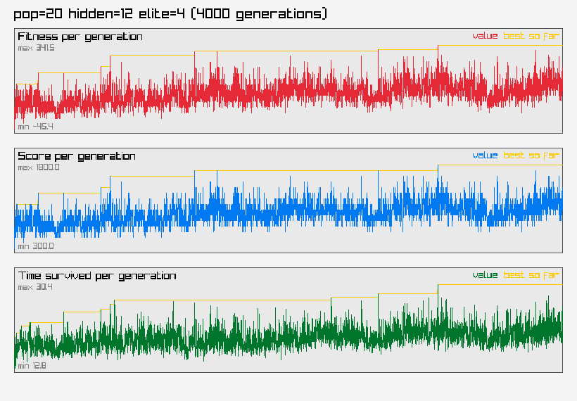

## pop20_hidden24

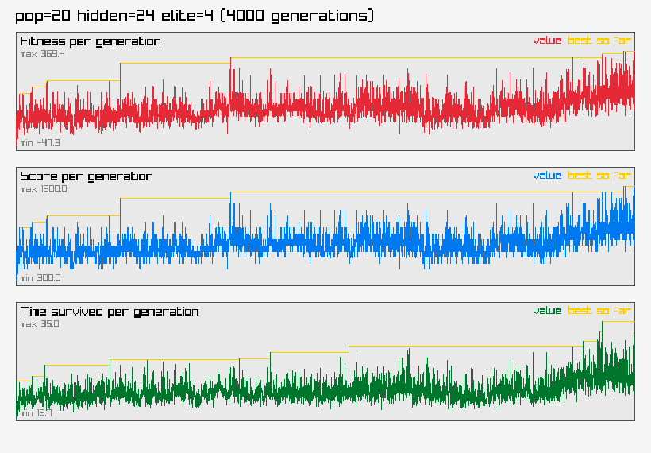

## pop20_hidden36

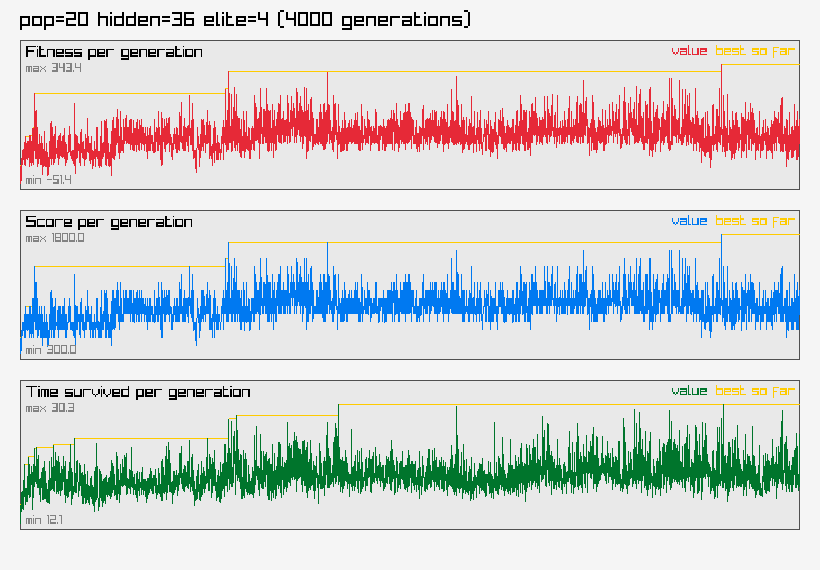

## pop20_hidden48

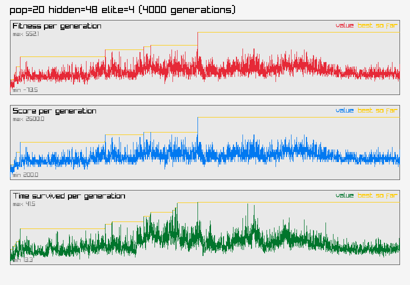

## pop40_hidden12


## pop40_hidden24


## pop40_hidden36

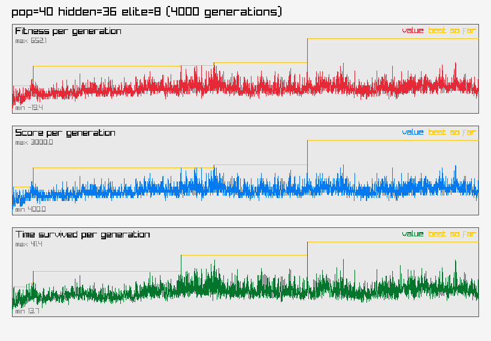

## pop40_hidden48

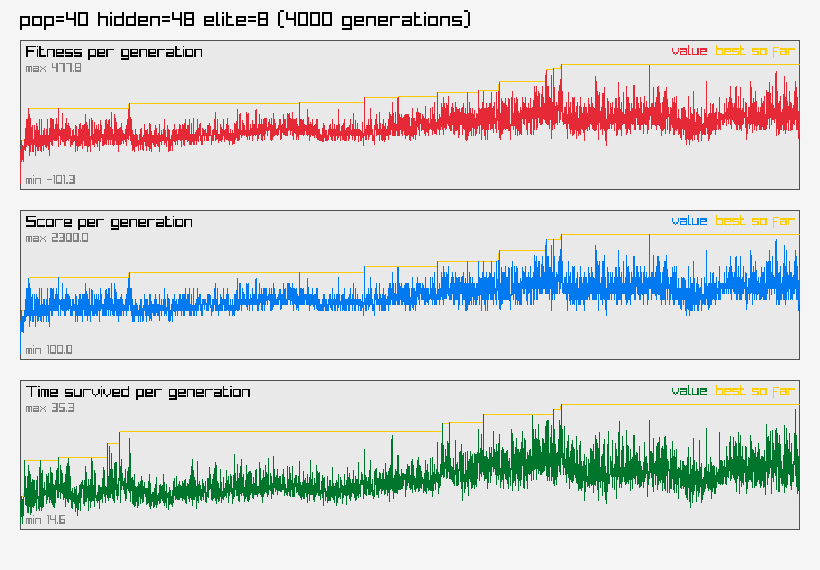

## pop60_hidden12

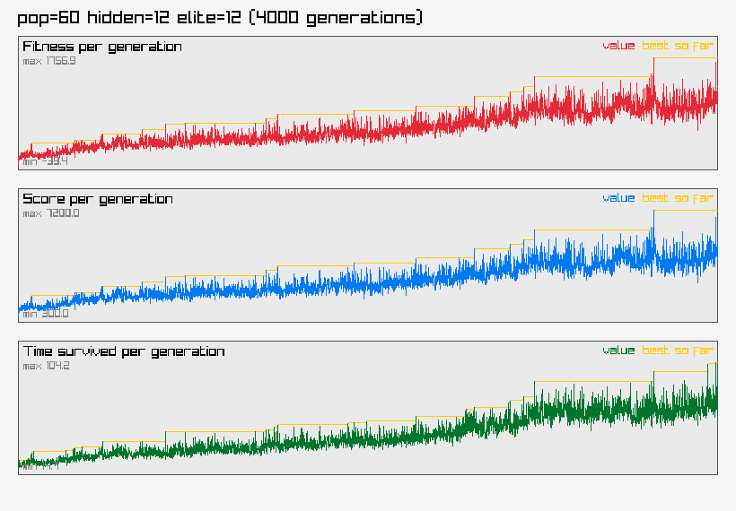

## pop60_hidden24


## pop60_hidden36

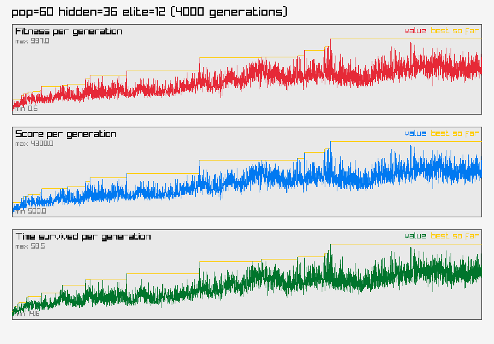

## pop60_hidden48

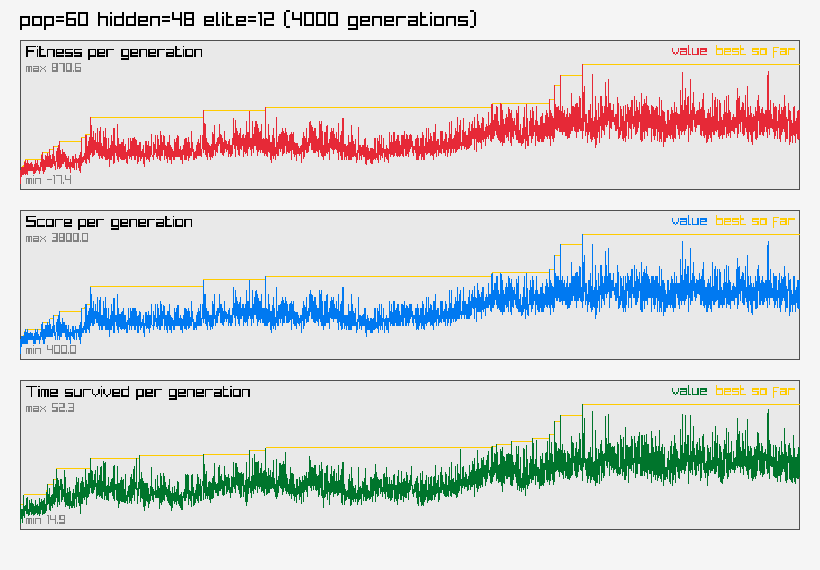

## pop80_hidden12


## pop80_hidden24

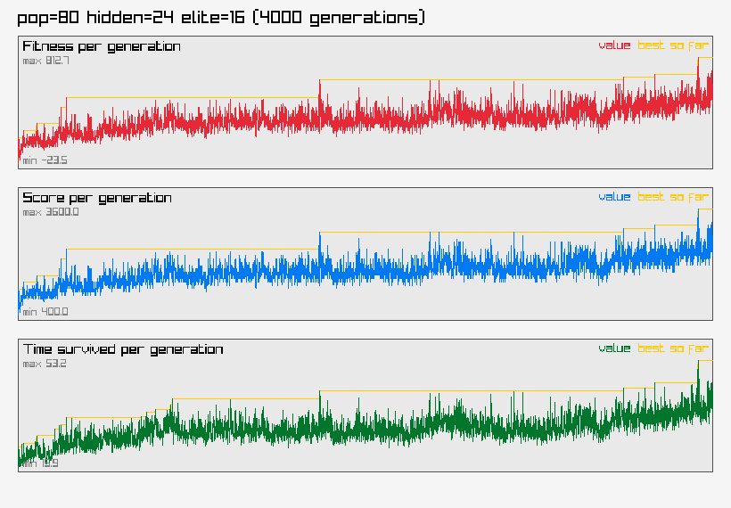

## pop80_hidden36

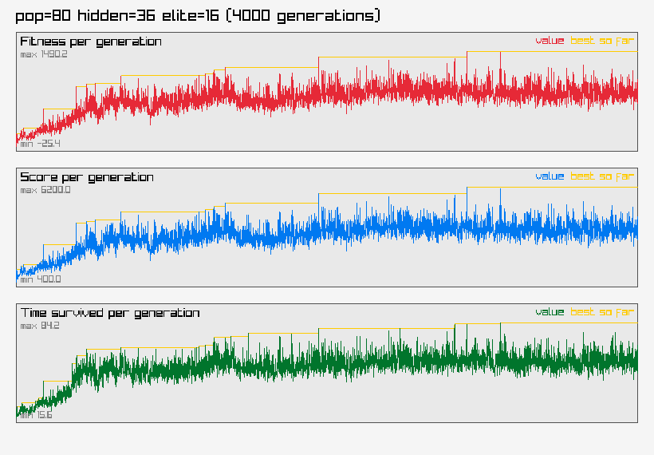

## pop80_hidden48


