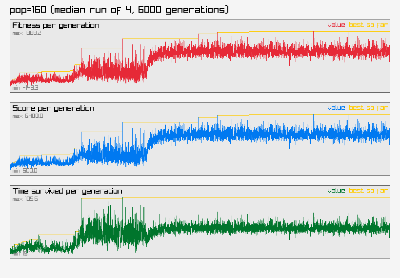

# Parameter Sweep Results

See [ARCHITECTURE.md](ARCHITECTURE.md) for the current NEAT design. An earlier fixed-topology approach's architecture, sweep results, and graphs are preserved in [archive/v1-fixed-topology/](archive/v1-fixed-topology/) for reference.

## Usage

```
make dev    # build and play the game interactively
make sweep  # run this parameter sweep (override with ARGS="--populations=20,40,60,80 --generations=4000 --repeats=4 --seed=42")
```

Each configuration below trained 4 times for 6000 generations each. populations=[80,160] mutationRate=0.15 mutationStrength=0.50

Trained in 3905.0s total (wall clock, running all configs/repeats in parallel across CPU threads).

Seed: `42` — every genome's episode and every mutation/crossover/selection decision is deterministically derived from this, so re-running with `--seed=42` (same code, same other flags) reproduces this exact run byte-for-byte, regardless of core count or thread scheduling. Different repeats of the same config still get independent draws (the seed is combined with the config/repeat index first).

Median is the primary ranking column — `bestFitness` is already a running-max over thousands of episodes within one run, so a single lucky episode can inflate it; the median across repeats resists that better than the mean does. Mean is shown alongside so an outlier-prone config (mean and median far apart) is visible rather than hidden.

| Population | Repeats | Generations | Median Fitness | Mean Fitness | Median Score | Mean Score | Median Time | Mean Time | Total Train Time (s) |
|---|---|---|---|---|---|---|---|---|---|
| 80 | 4 | 6000 | 1345.8 | 1980.1 | 6100 | 8550.0 | 114.9 | 136.6 | 6958.2 |
| 160 | 4 | 6000 | 1656.5 | 1688.5 | 7350 | 7475.0 | 118.9 | 116.1 | 9192.7 |

## pop80


## pop160



## Input usage

Average |weight| of enabled connections from each input, across every genome in every config/repeat's final population — a rough "how much does the evolved population actually rely on this input" signal. An input sitting near zero here across the whole sweep is a candidate to drop from `GetPlayerState` (fewer inputs means fewer connections for every genome to evaluate, speeding up every `Activate` call) — but check this holds up across more than one sweep before cutting anything, since a single run's population can converge on ignoring a genuinely useful input just by chance.

**Most relied on:** `nearbyEnemyCount` (avg |weight| 3.286). **Least relied on:** `enemy#1.health` (avg |weight| 1.043).

| Input | Avg \|weight\| | Samples |
|---|---|---|
| nearbyEnemyCount | 3.286 | 2074 |
| enemy#2.closingSpeed | 3.263 | 2103 |
| enemy#3.distance | 3.125 | 1906 |
| enemy#1.bodyX | 3.112 | 1660 |
| player.velocityY | 3.102 | 2148 |
| enemy#2.bodyY | 2.920 | 1800 |
| player.x | 2.827 | 2013 |
| player.wallDistX | 2.696 | 1770 |
| player.touchCooldown | 2.425 | 1672 |
| enemy#1.bodyVX | 2.286 | 1741 |
| enemy#1.closingSpeed | 2.280 | 2296 |
| player.facingCos | 2.228 | 1678 |
| enemy#1.bodyVY | 2.221 | 1875 |
| enemy#4.bodyY | 2.048 | 1625 |
| player.facingSin | 2.005 | 1687 |
| enemy#1.distance | 1.970 | 1689 |
| forwardConeEnemyCount | 1.963 | 2132 |
| player.velocityX | 1.897 | 1560 |
| player.health | 1.826 | 2257 |
| enemy#3.closingSpeed | 1.817 | 1787 |
| player.y | 1.781 | 1651 |
| enemy#4.closingSpeed | 1.734 | 1827 |
| enemy#4.distance | 1.728 | 1752 |
| enemy#3.bodyVY | 1.701 | 1959 |
| enemy#2.bodyX | 1.642 | 1560 |
| enemy#2.distance | 1.615 | 1876 |
| enemy#1.bodyY | 1.561 | 2006 |
| enemy#4.bodyVX | 1.512 | 1561 |
| enemy#4.bodyX | 1.506 | 1660 |
| player.wallDistY | 1.484 | 1689 |
| enemy#3.bodyX | 1.351 | 1629 |
| enemy#4.health | 1.277 | 1703 |
| enemy#3.bodyY | 1.272 | 1589 |
| enemy#2.health | 1.260 | 1753 |
| enemy#2.bodyVY | 1.251 | 1470 |
| enemy#4.bodyVY | 1.236 | 1794 |
| enemy#3.health | 1.181 | 1740 |
| enemy#2.bodyVX | 1.124 | 1500 |
| enemy#3.bodyVX | 1.053 | 1352 |
| enemy#1.health | 1.043 | 2017 |

## Fittest genome overall

`pop80` run 1 — fitness 4770.8, score 19200, time 258.3


### Diagnostics for that run

**Reward breakdown** (of that fittest episode's 4770.8 total): survival 12.9, hits 1198.0, kills 3840.0, touch penalty -250.0, death penalty -30.0.

**Shot accuracy:** 599/1125 (53.2%).

**Species count:** 6 at the final generation (ranged 1-21 over the run).

**Population complexity at the final generation:** avg 86.9 hidden nodes, avg 42.2 enabled connections per genome.

**Deepest stagnation reached:** 12 generations without improving (mutation/structural-mutation boost peaked around 1.2x).

