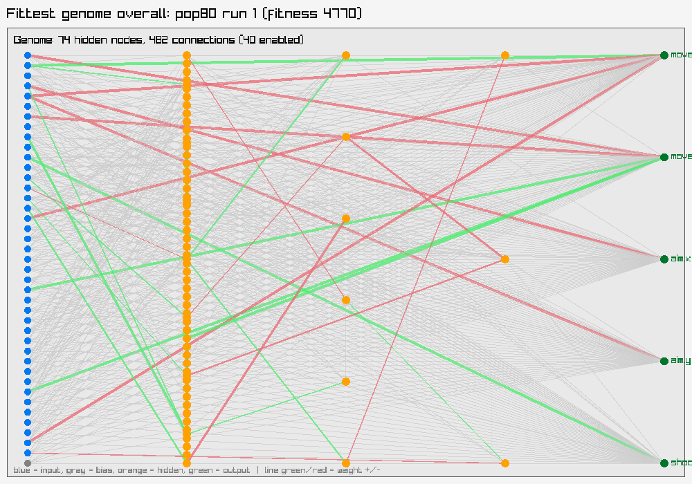

# Parameter Sweep Results

See [ARCHITECTURE.md](ARCHITECTURE.md) for the current NEAT design. An earlier fixed-topology approach's architecture, sweep results, and graphs are preserved in [archive/v1-fixed-topology/](archive/v1-fixed-topology/) for reference.

## Usage

```
make dev    # build and play the game interactively
make sweep  # run this parameter sweep (override with ARGS="--populations=20,40,60,80 --generations=4000 --repeats=4 --seed=42")
```

Each configuration below trained 4 times for 6000 generations each. populations=[80] mutationRate=0.15 mutationStrength=0.50

Trained in 704.3s total (wall clock, running all configs/repeats in parallel across CPU threads).

Seed: `3066333485829883169` — every genome's episode and every mutation/crossover/selection decision is deterministically derived from this, so re-running with `--seed=3066333485829883169` (same code, same other flags) reproduces this exact run byte-for-byte, regardless of core count or thread scheduling. Different repeats of the same config still get independent draws (the seed is combined with the config/repeat index first).

Median is the primary ranking column — `bestFitness` is already a running-max over thousands of episodes within one run, so a single lucky episode can inflate it; the median across repeats resists that better than the mean does. Mean is shown alongside so an outlier-prone config (mean and median far apart) is visible rather than hidden.

| Population | Repeats | Generations | Median Fitness | Mean Fitness | Median Score | Mean Score | Median Time | Mean Time | Total Train Time (s) |
|---|---|---|---|---|---|---|---|---|---|
| 80 | 4 | 6000 | 1354.3 | 2081.6 | 6250 | 9025.0 | 89.4 | 128.6 | 1415.3 |

## pop80


## Input usage

Average |weight| of enabled connections from each input, across every genome in every config/repeat's final population — a rough "how much does the evolved population actually rely on this input" signal. An input sitting near zero here across the whole sweep is a candidate to drop from `GetPlayerState` (fewer inputs means fewer connections for every genome to evaluate, speeding up every `Activate` call) — but check this holds up across more than one sweep before cutting anything, since a single run's population can converge on ignoring a genuinely useful input just by chance.

**Most relied on:** `player.x` (avg |weight| 3.435). **Least relied on:** `player.velocityX` (avg |weight| 1.280).

| Input | Avg \|weight\| | Samples |
|---|---|---|
| player.x | 3.435 | 1159 |
| enemy#1.bodyY | 3.407 | 1217 |
| enemy#4.distance | 2.826 | 1161 |
| enemy#1.bodyX | 2.723 | 1272 |
| enemy#1.closingSpeed | 2.693 | 1389 |
| enemy#2.distance | 2.614 | 1318 |
| player.touchCooldown | 2.604 | 1227 |
| player.y | 2.491 | 1076 |
| reverseMoveConeEnemyCount | 2.486 | 1078 |
| enemy#2.closingSpeed | 2.412 | 1039 |
| enemy#3.bodyX | 2.382 | 1049 |
| enemy#3.bodyY | 2.368 | 1194 |
| enemy#2.health | 2.272 | 931 |
| enemy#3.bodyVX | 2.211 | 1195 |
| enemy#1.health | 2.192 | 1324 |
| player.facingSin | 2.179 | 1254 |
| enemy#4.health | 2.158 | 1406 |
| nearbyEnemyCount | 2.134 | 1080 |
| enemy#1.bodyVY | 2.066 | 1062 |
| enemy#2.bodyVX | 2.060 | 1070 |
| enemy#4.bodyY | 2.043 | 930 |
| player.wallDistX | 2.034 | 1134 |
| forwardConeEnemyCount | 1.982 | 1247 |
| enemy#2.bodyX | 1.959 | 1138 |
| enemy#3.closingSpeed | 1.947 | 1187 |
| enemy#4.closingSpeed | 1.913 | 920 |
| player.facingCos | 1.910 | 1240 |
| enemy#4.bodyVX | 1.901 | 993 |
| player.velocityY | 1.875 | 1202 |
| enemy#1.distance | 1.858 | 1082 |
| enemy#4.bodyX | 1.854 | 1119 |
| enemy#4.bodyVY | 1.848 | 1152 |
| enemy#3.health | 1.764 | 1266 |
| player.health | 1.748 | 997 |
| enemy#3.distance | 1.650 | 783 |
| player.wallDistY | 1.643 | 1116 |
| enemy#3.bodyVY | 1.639 | 921 |
| enemy#2.bodyY | 1.533 | 1029 |
| enemy#1.bodyVX | 1.422 | 893 |
| enemy#2.bodyVY | 1.412 | 989 |
| player.velocityX | 1.280 | 1053 |

## Fittest genome overall

`pop80` run 3 — fitness 5165.6, score 20800, time 277.8



**Reproduce this run's whole trajectory** (checkpoints + gifs at each generation milestone):

```
make recordings ARGS="--population=80 --mutation-rate=0.15 --mutation-strength=0.50 --seed=16201731495207994628 --checkpoints=1,...,6000"
```

### Diagnostics for that run

**Reward breakdown** (of that fittest episode's 5165.6 total): survival 13.9, hits 1272.0, kills 4160.0, touch penalty -250.0, death penalty -30.0.

**Shot accuracy:** 636/1275 (49.9%).

**Species count:** 7 at the final generation (ranged 1-23 over the run).

**Population complexity at the final generation:** avg 19.3 hidden nodes, avg 119.8 enabled connections per genome.

**Deepest stagnation reached:** 11 generations without improving (mutation/structural-mutation boost peaked around 1.2x).

