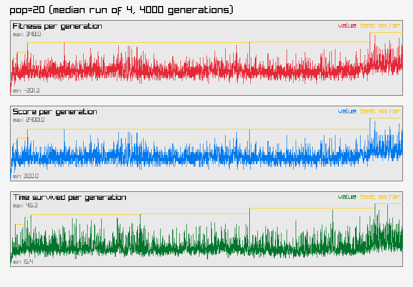
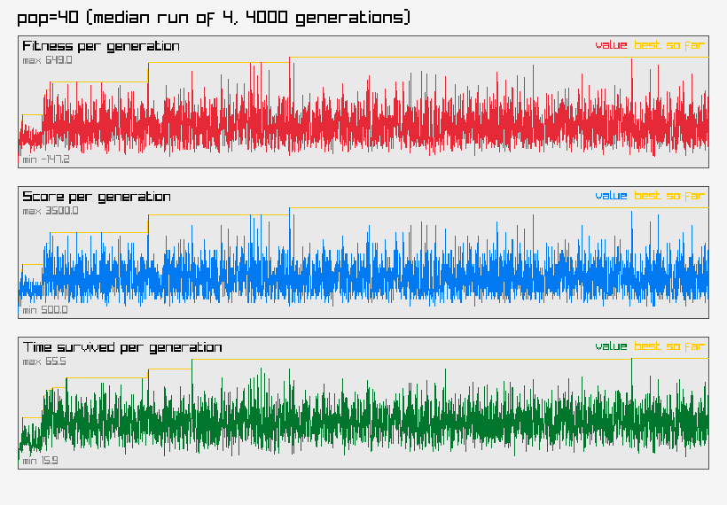
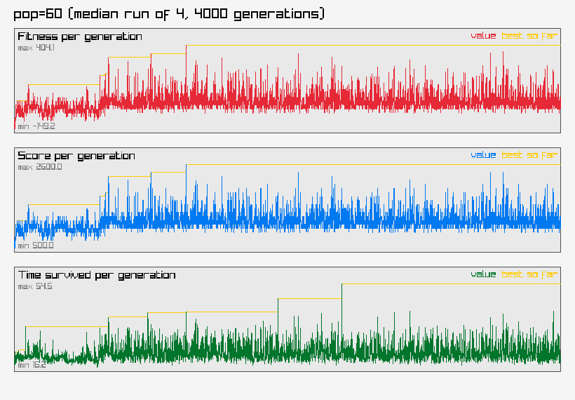
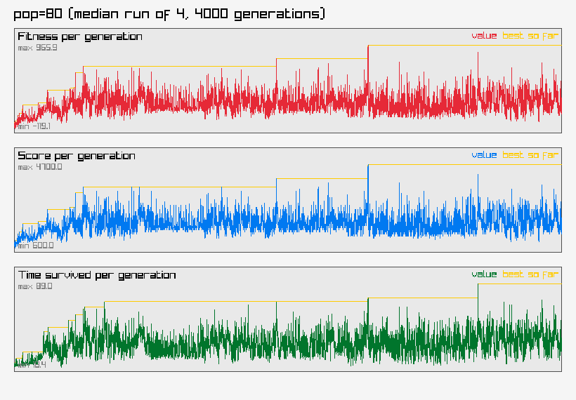

# Parameter Sweep Results

See [ARCHITECTURE.md](ARCHITECTURE.md) for the current NEAT design. An earlier fixed-topology approach's architecture, sweep results, and graphs are preserved in [archive/v1-fixed-topology/](archive/v1-fixed-topology/) for reference.

## Usage

```
make dev    # build and play the game interactively
make sweep  # run this parameter sweep (override with ARGS="--populations=20,40,60,80 --generations=4000 --repeats=4")
```

Each configuration below trained 4 times for 4000 generations each. populations=[20,40,60,80] mutationRate=0.15 mutationStrength=0.50

Trained in 779.0s total (wall clock, running all configs/repeats in parallel across CPU threads).

Median is the primary ranking column — `bestFitness` is already a running-max over thousands of episodes within one run, so a single lucky episode can inflate it; the median across repeats resists that better than the mean does. Mean is shown alongside so an outlier-prone config (mean and median far apart) is visible rather than hidden.

| Population | Repeats | Generations | Median Fitness | Mean Fitness | Median Score | Mean Score | Median Time | Mean Time | Total Train Time (s) |
|---|---|---|---|---|---|---|---|---|---|
| 20 | 4 | 4000 | 427.1 | 398.3 | 2700 | 2550.0 | 48.1 | 53.5 | 726.4 |
| 40 | 4 | 4000 | 877.3 | 786.6 | 4400 | 4050.0 | 68.9 | 66.3 | 1124.5 |
| 60 | 4 | 4000 | 434.4 | 1204.8 | 2700 | 5675.0 | 57.0 | 83.8 | 1098.0 |
| 80 | 4 | 4000 | 1073.8 | 1602.3 | 5150 | 7200.0 | 81.3 | 100.5 | 1456.8 |

## pop20



## pop40



## pop60



## pop80



