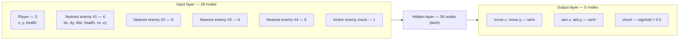
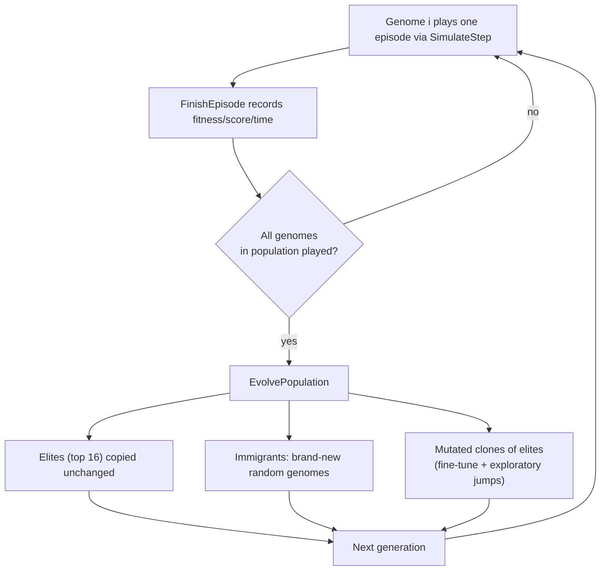

# Architecture (v1 — archived)

> This is a snapshot of the project's architecture before it was rewritten to use NEAT
> (variable-topology neuroevolution with speciation). It's kept here for reference —
> see [../../ARCHITECTURE.md](../../ARCHITECTURE.md) for the current design.

## Stack

- C++17, raylib for window/input/drawing/shapes
- CMake, Makefile wrapper (`make dev`, `make sweep`)
- no ML libraries. neural net and genetic algorithm are both hand-rolled
- std::thread for the sweep, nothing else external

## ML approach

- neuroevolution, not gradient-based RL. no backprop, no loss function, no policy gradient.
- a genome is just a neural net's weight vector. selection + mutation on weights IS the training.
- (μ+λ) evolution strategy: elites copied unchanged each generation, rest are mutated clones + a few random immigrants.
- fitness = reward from actually playing the episode (survival + hits + kills - death penalty).
- mutation strength auto-ramps up when fitness stalls, back down once it improves.

## Network inputs and outputs

The brain is a fixed-topology feedforward net: input → hidden (tanh) → output (raw, activated by the caller). Sizes are computed from `PLAYER_AGENT_*` constants in PlayerAgent.h, so they always match what `GetPlayerState`/`DecidePlayerAction` in PlayerAgent.cpp actually build/decode.

**Inputs — 28 total** (`PLAYER_AGENT_INPUT_SIZE`): 3 player features, 6 features for each of the 4 nearest enemies (closest first), 1 aggregate feature.

| # | Feature | Normalization |
|---|---|---|
| 0 | player x | `/ screenWidth` |
| 1 | player y | `/ screenHeight` |
| 2 | player health | `/ maxHealth` |
| 3–8 | nearest enemy: dx, dy, distance, health, vx, vy | dx/dy `/ screen{W,H}`, distance `/ screen diagonal`, health `/ maxHealth`, vx/vy `/ screen{W,H}` |
| 9–14 | 2nd-nearest enemy: same 6 features | same |
| 15–20 | 3rd-nearest enemy: same 6 features | same |
| 21–26 | 4th-nearest enemy: same 6 features | same |
| 27 | active enemy count | `min(count / 10, 1.0)` |

An empty enemy slot (fewer than 4 enemies alive) zeroes its 6 features except distance, which is set to `1.0` ("maximally far away") so the network can tell "no enemy here" apart from "an enemy is very close."

**Outputs — 5 total** (`PLAYER_AGENT_OUTPUT_SIZE`), decoded in `DecidePlayerAction`:

| # | Meaning | Activation |
|---|---|---|
| 0 | move.x | `tanh` |
| 1 | move.y | `tanh` |
| 2 | aim.x | `tanh` |
| 3 | aim.y | `tanh` |
| 4 | shoot | `sigmoid > 0.5` |

If both aim outputs are ~0, the player keeps its current facing rather than snapping to an undefined direction.

**Evolution loop**, one generation:

Immigrant count and mutation strength both scale up the longer the population has gone without improving (see `stagnationBoost` in Evolution.cpp).

## Files

**main.cpp** — entry point. picks `--sweep` or the interactive loop. owns the window, HUD, speed button, autosave timing.

**Simulation.h/.cpp** — all the game constants (player/bullet/enemy/reward/evolution defaults) and `SimulateStep`, one game tick: movement, shooting, collisions, reward, episode end. Used by both interactive play and the sweep.

**Player.h/.cpp, Enemy.h/.cpp** — plain structs + free functions, no classes. position, health, collision boxes, drawing.

**NeuralNetwork.h/.cpp** — tiny feedforward net, input → hidden (tanh) → output. the genome is just the weight vector.

**PlayerAgent.h/.cpp** — glue between game state and the network. builds the input vector (player + 4 nearest enemies), decodes outputs into move/aim/shoot.

**Evolution.h/.cpp** — population, generations, elitism + mutation, stagnation-triggered mutation boost. save/load to `save.dat` — versioned, deliberately refuses to load a file with the wrong shape.

**HistoryGraph.h/.cpp** — the fitness/score/time line graphs. same drawing code renders the in-game Tab overlay and the sweep's exported PNGs.

**ParameterSweep.h/.cpp** — `--sweep` mode. CLI flag parsing, runs configs across worker threads, writes `sweep_results.txt` + `README.md` + `sweep_images/`.

**RandomUtil.h** — thread-local RNG. exists because the sweep runs configs in parallel and raylib's `GetRandomValue` isn't thread-safe.

## Why it's split this way

- `SimulateStep` doesn't know or care if anyone's watching — same function runs live in the window at 1x-49152x speed, or headless on a sweep thread.
- game logic never calls raylib drawing functions, only `CheckCollisionRecs` (pure math, safe off the main thread).
- sweep training runs fully parallel with no window at all. the window only opens afterward, on the main thread, to export PNGs — raylib's GL calls aren't thread-safe so that part has to stay single-threaded.

## Why this was replaced

NEAT (variable-topology genomes + speciation + crossover) replaced this fixed-topology (μ+λ) approach so:
- structure (hidden nodes/connections) can grow only where useful instead of being fixed upfront by a `HIDDEN_SIZE` guess tuned via sweep,
- new structural mutations get protected by speciation long enough to be tuned instead of instantly competing against fully-optimized genomes,
- crossover became meaningful (two genomes' genes align by innovation number instead of by raw position in a flat weight vector).
