# Parameter Sweep Results (v1 — archived)

> These results are from the old fixed-topology (μ+λ) network, before the project moved to
> NEAT. `--hidden`/`eliteRatio` no longer exist as sweep options. See
> [ARCHITECTURE.md](ARCHITECTURE.md) in this folder for the architecture these results were
> produced under, and [../../ARCHITECTURE.md](../../ARCHITECTURE.md) for the current one.

## Usage

```
make dev    # build and play the game interactively
make sweep  # run this parameter sweep (override with ARGS="--populations=20,40 --hidden=12,24 --generations=4000 --repeats=4")
```

Each configuration below trained 4 times for 4000 generations each. populations=[20,40,60,80] hidden=[12,24,36,48] eliteRatio=0.20 mutationRate=0.15 mutationStrength=0.50

Trained in 3806.3s total (wall clock, running all configs/repeats in parallel across CPU threads).

Median is the primary ranking column — `bestFitness` is already a running-max over thousands of episodes within one run, so a single lucky episode can inflate it; the median across repeats resists that better than the mean does. Mean is shown alongside so an outlier-prone config (mean and median far apart) is visible rather than hidden.

| Population | Hidden | Elites | Repeats | Generations | Median Fitness | Mean Fitness | Median Score | Mean Score | Median Time | Mean Time | Total Train Time (s) |
|---|---|---|---|---|---|---|---|---|---|---|---|
| 20 | 12 | 4 | 4 | 4000 | 467.8 | 476.3 | 2250 | 2300.0 | 35.7 | 35.7 | 197.4 |
| 20 | 24 | 4 | 4 | 4000 | 438.8 | 450.0 | 2150 | 2175.0 | 37.3 | 41.3 | 255.9 |
| 20 | 36 | 4 | 4 | 4000 | 450.8 | 459.8 | 2200 | 2225.0 | 42.8 | 42.7 | 291.3 |
| 20 | 48 | 4 | 4 | 4000 | 351.5 | 359.1 | 1800 | 1825.0 | 31.3 | 33.1 | 310.2 |
| 40 | 12 | 8 | 4 | 4000 | 1358.0 | 1304.5 | 5650 | 5425.0 | 81.2 | 81.3 | 867.0 |
| 40 | 24 | 8 | 4 | 4000 | 958.9 | 1000.6 | 4150 | 4300.0 | 67.4 | 67.6 | 844.3 |
| 40 | 36 | 8 | 4 | 4000 | 760.5 | 858.8 | 3400 | 3750.0 | 52.9 | 56.8 | 967.3 |
| 40 | 48 | 8 | 4 | 4000 | 924.0 | 879.9 | 4000 | 3825.0 | 61.2 | 58.6 | 1148.8 |
| 60 | 12 | 12 | 4 | 4000 | 1039.2 | 1077.8 | 4450 | 4600.0 | 66.0 | 67.4 | 1063.4 |
| 60 | 24 | 12 | 4 | 4000 | 1337.5 | 1586.8 | 5550 | 6525.0 | 95.9 | 99.6 | 1681.1 |
| 60 | 36 | 12 | 4 | 4000 | 1628.9 | 1625.3 | 6650 | 6650.0 | 96.6 | 95.6 | 1966.8 |
| 60 | 48 | 12 | 4 | 4000 | 1561.7 | 1533.4 | 6400 | 6325.0 | 94.3 | 91.0 | 2202.3 |
| 80 | 12 | 16 | 4 | 4000 | 4219.1 | 4241.0 | 16500 | 16625.0 | 230.0 | 229.8 | 6277.2 |
| 80 | 24 | 16 | 4 | 4000 | 2091.2 | 2340.0 | 8400 | 9375.0 | 122.5 | 131.5 | 3723.7 |
| 80 | 36 | 16 | 4 | 4000 | 1391.1 | 1470.3 | 5750 | 6075.0 | 83.0 | 87.1 | 2463.0 |
| 80 | 48 | 16 | 4 | 4000 | 2628.3 | 2476.9 | 10400 | 9850.0 | 148.2 | 139.8 | 3295.3 |

## pop20_hidden12

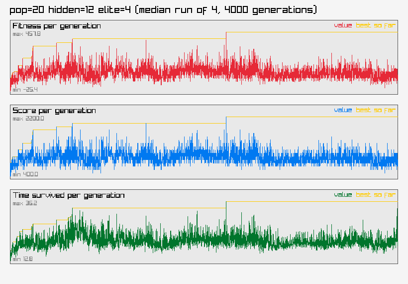

## pop20_hidden24

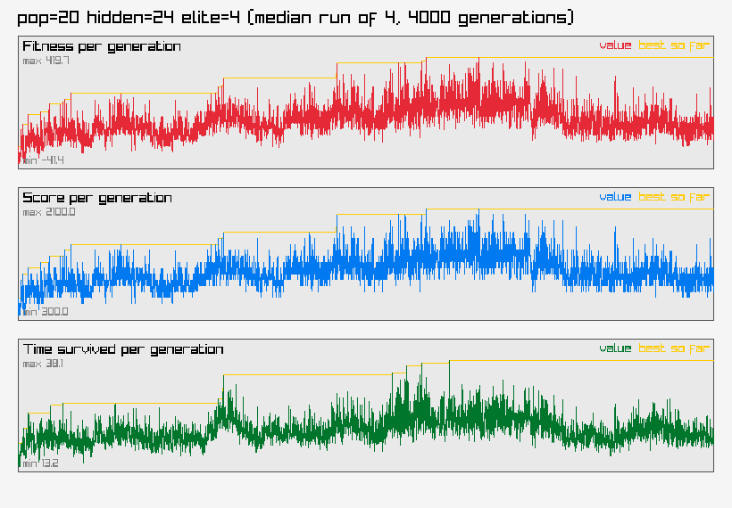

## pop20_hidden36

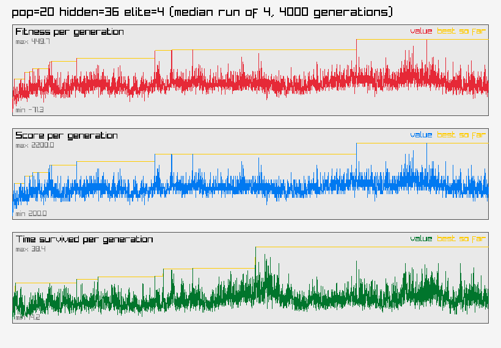

## pop20_hidden48

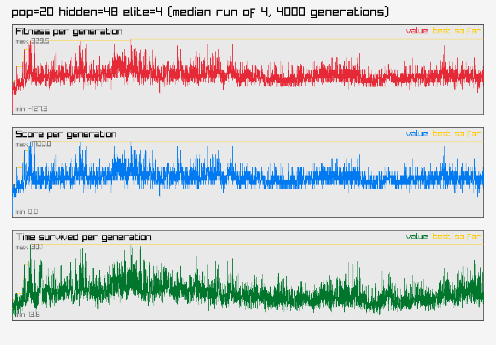

## pop40_hidden12

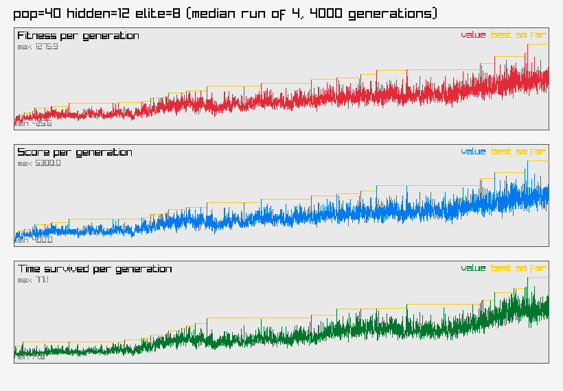

## pop40_hidden24

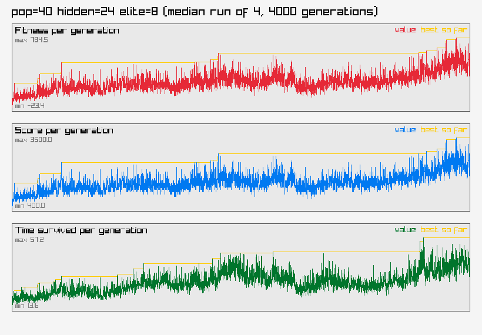

## pop40_hidden36

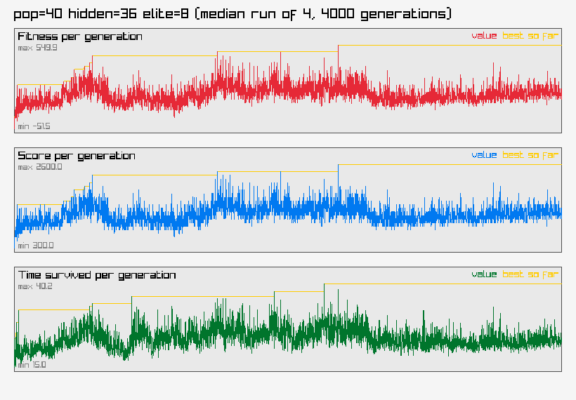

## pop40_hidden48

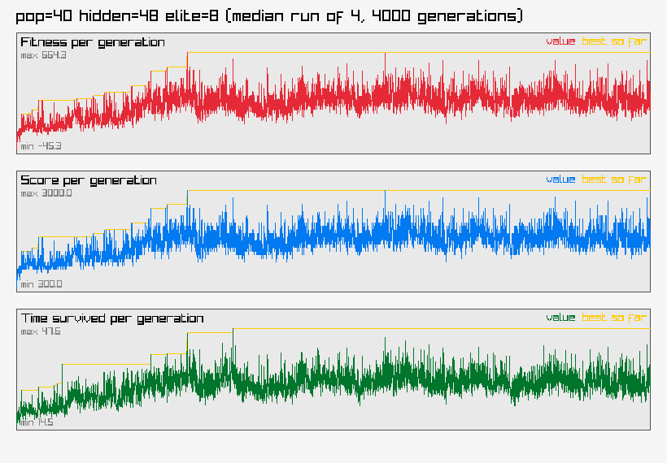

## pop60_hidden12

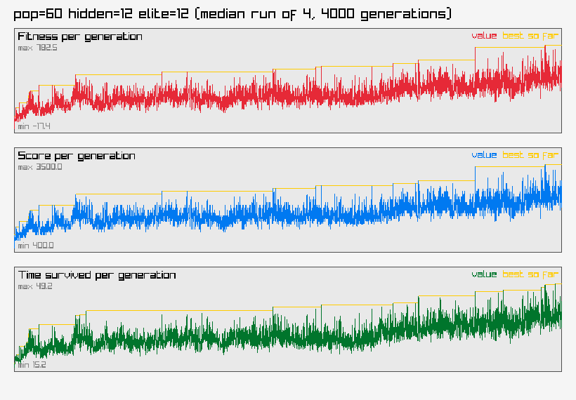

## pop60_hidden24

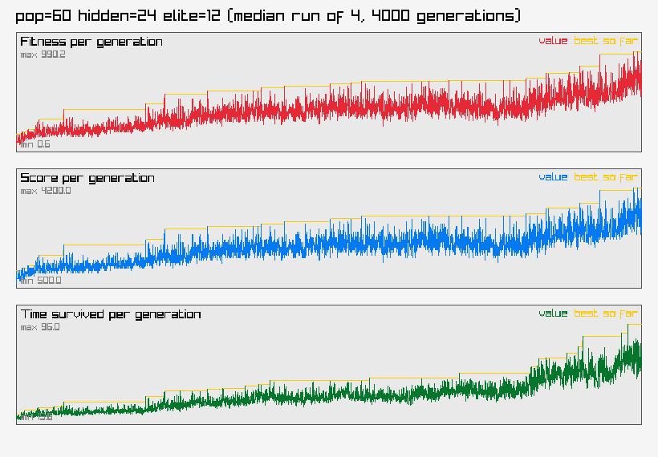

## pop60_hidden36

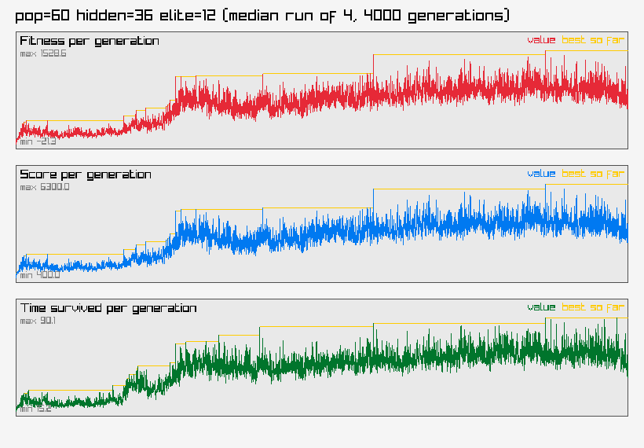

## pop60_hidden48

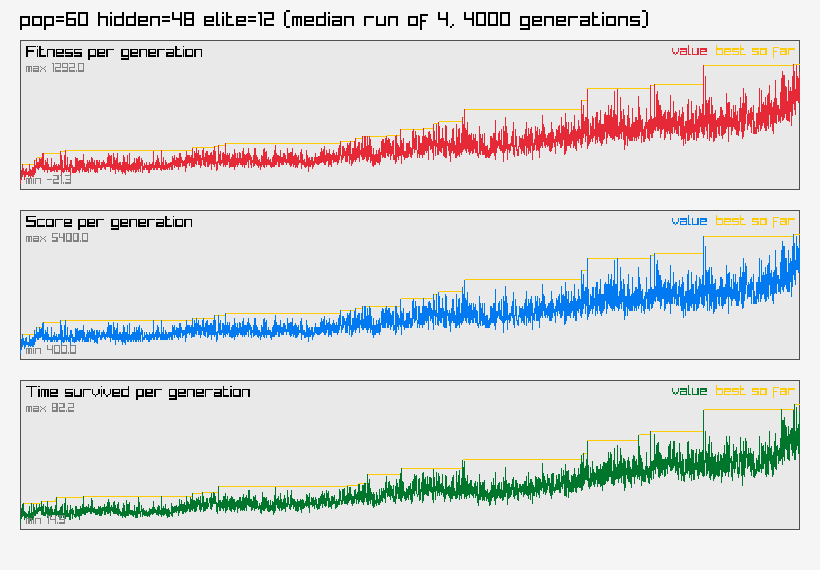

## pop80_hidden12

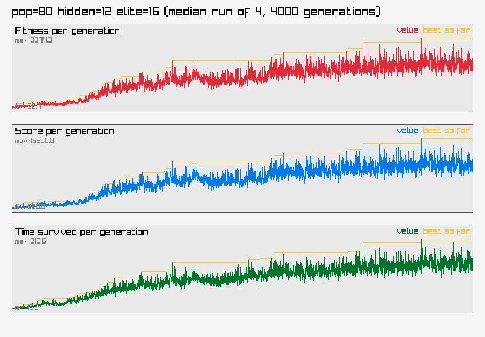

## pop80_hidden24

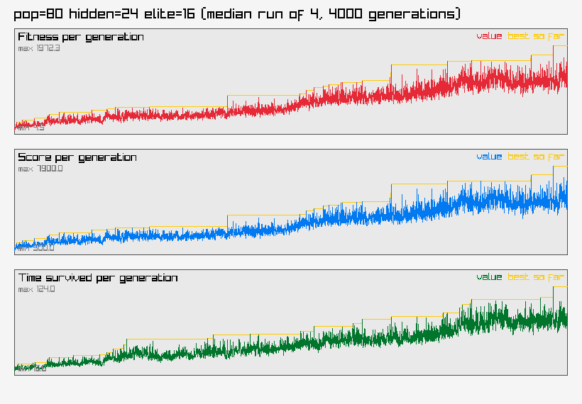

## pop80_hidden36

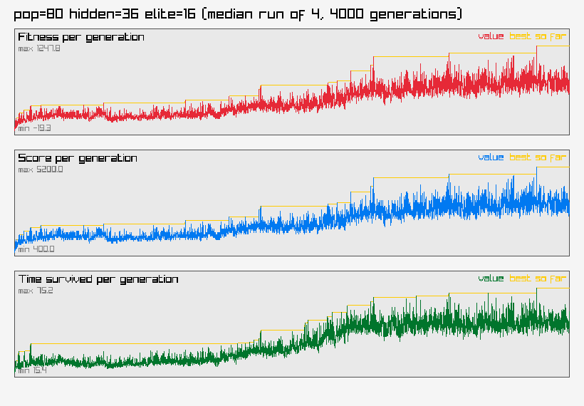

## pop80_hidden48

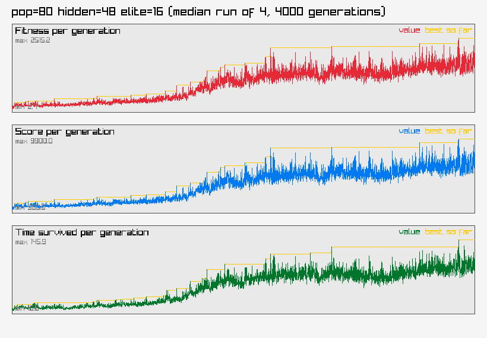

